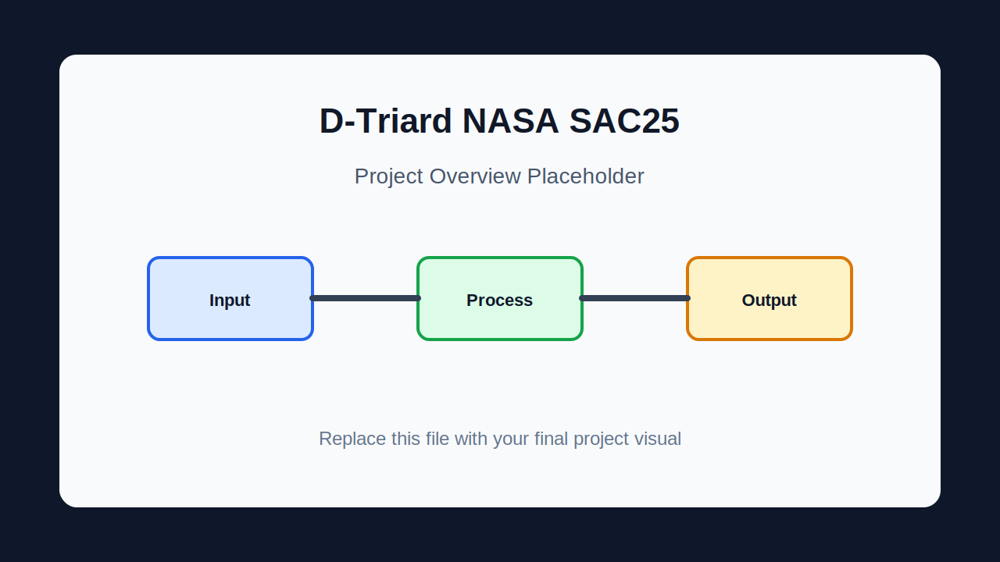
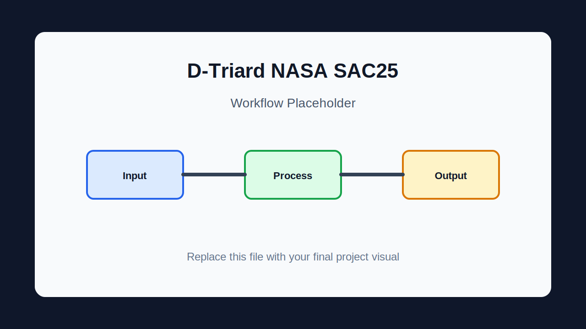



[![Contributors][contributors-shield]][contributors-url]
[![Forks][forks-shield]][forks-url]
[![Stargazers][stars-shield]][stars-url]
[![Issues][issues-shield]][issues-url]

 

  

  <h3 align="center">D-Triard NASA SAC25</h3>

  

    Django event-planning app that uses NASA POWER climate data and OpenStreetMap geocoding to estimate rain risk for future events and save forecast history.
     
    <a href="docs/GITHUB_DESCRIPTION.md"><strong>Explore the docs »</strong></a>
     
     
    <a href="#usage">View Usage</a>
    &middot;
    <a href="https://github.com/ille-amissus/D-Triard-NASA-SAC25/issues/new">Report Bug</a>
    &middot;
    <a href="https://github.com/ille-amissus/D-Triard-NASA-SAC25/issues/new">Request Feature</a>
  

  
Table of Contents

  <ol>
    <li><a href="#about-the-project">About The Project</a><ul><li><a href="#built-with">Built With</a></li></ul></li>
    <li><a href="#getting-started">Getting Started</a><ul><li><a href="#prerequisites">Prerequisites</a></li><li><a href="#installation">Installation</a></li></ul></li>
    <li><a href="#usage">Usage</a></li>
    <li><a href="#how-it-works">How It Works</a></li>
    <li><a href="#project-structure">Project Structure</a></li>
    <li><a href="#validation">Validation</a></li>
    <li><a href="#roadmap">Roadmap</a></li>
    <li><a href="#contributing">Contributing</a></li>
    <li><a href="#license">License</a></li>
    <li><a href="#contact">Contact</a></li>
    <li><a href="#acknowledgments">Acknowledgments</a></li>
  </ol>

## About The Project

[![Project overview placeholder][project-screenshot]](#usage)

Django event-planning app that uses NASA POWER climate data and OpenStreetMap geocoding to estimate rain risk for future events and save forecast history.

The repository currently offers:

- User signup, login, logout, and saved event history
- City and date based rain-risk calculation
- NASA POWER historical climate data lookup
- OpenStreetMap Nominatim geocoding
- Weighted probability based on precipitation, humidity, temperature, and wind
- Tailwind-powered planning and history interface

This README follows the shared template requested for the repository set and keeps the claims limited to files and documentation present in this project.

(<a href="#readme-top">back to top</a>)

### Built With

- Python
- Django
- SQLite
- Pandas
- Requests
- NASA POWER API
- OpenStreetMap Nominatim
- HTML
- CSS
- JavaScript

(<a href="#readme-top">back to top</a>)

## Getting Started

Follow these steps to clone the repository and run the project locally.

### Prerequisites

- Python 3
- pip
- Internet access for NASA POWER and Nominatim requests

### Installation

~~~bash
git clone https://github.com/ille-amissus/D-Triard-NASA-SAC25.git
cd D-Triard-NASA-SAC25
python -m venv .venv
pip install -r requirements.txt
python manage.py migrate
python manage.py runserver
~~~

(<a href="#readme-top">back to top</a>)

## Usage

Useful commands and entry points:

~~~bash
python manage.py runserver
~~~

~~~bash
Open http://127.0.0.1:8000/
~~~

~~~bash
Use /api/climatology/?city=Sakarya&month=7&day=15
~~~

### Visual Placeholders

Placeholder images are included under `docs/images/` so you can replace them manually later without changing the README layout.

  
  

Suggested final visuals:

- Project overview screenshot or main terminal output.
- Workflow, architecture, or data-flow diagram.
- Example result, dashboard, report, or generated artifact screenshot.
- Short GIF only when it is small and useful.

Avoid committing large raw videos, private datasets, credentials, runtime logs, or generated secrets. Use sanitized screenshots and diagrams.

(<a href="#readme-top">back to top</a>)

## How It Works

`	ext
User event form -> Django route -> geocoding -> NASA POWER climatology -> rain probability -> saved event history
`

(<a href="#readme-top">back to top</a>)

## Project Structure

- NasaRain/ - Django project settings
- myapp/ - views, URLs, models, templates, static assets, services
- docs/ - API, deployment, tutorial, visuals, and GitHub notes
- requirements.txt - Python dependencies
- manage.py - Django CLI

(<a href="#readme-top">back to top</a>)

## Validation

Run the most relevant checks for this repository:

~~~bash
python manage.py check
~~~

~~~bash
python manage.py test
~~~

Some validations depend on local tools, services, datasets, API credentials, or a configured lab environment.

(<a href="#readme-top">back to top</a>)

## Roadmap

- [ ] Replace placeholder images with final screenshots or diagrams.
- [ ] Keep setup commands synchronized with the current project files.
- [ ] Add more examples or test fixtures when the project grows.
- [ ] Add a repository-level license if the project will be reused outside its original context.

See the [open issues](https://github.com/ille-amissus/D-Triard-NASA-SAC25/issues) for proposed features and known issues.

(<a href="#readme-top">back to top</a>)

## Contributing

Contributions are welcome for documentation, examples, tests, and implementation improvements.

1. Fork the project.
2. Create your feature branch:

   ~~~bash
   git checkout -b feature/AmazingFeature
   ~~~

3. Commit your changes:

   ~~~bash
   git commit -m "Add some AmazingFeature"
   ~~~

4. Push to the branch:

   ~~~bash
   git push origin feature/AmazingFeature
   ~~~

5. Open a pull request.

(<a href="#readme-top">back to top</a>)

### Top Contributors

## License

No repository-level license file was verified in this project. Add a license before reuse or distribution outside the intended coursework, lab, or prototype context.

(<a href="#readme-top">back to top</a>)

## Contact

Project owner: [@ille-amissus](https://github.com/ille-amissus)

Project Link: [https://github.com/ille-amissus/D-Triard-NASA-SAC25](https://github.com/ille-amissus/D-Triard-NASA-SAC25)

(<a href="#readme-top">back to top</a>)

## Acknowledgments

- README structure adapted from [ahmed3bahaa/readme-template](https://github.com/ahmed3bahaa/readme-template).
- Project files, reports, fixtures, and documentation included in this repository.

(<a href="#readme-top">back to top</a>)

[contributors-shield]: https://img.shields.io/github/contributors/ille-amissus/D-Triard-NASA-SAC25.svg?style=for-the-badge
[contributors-url]: https://github.com/ille-amissus/D-Triard-NASA-SAC25/graphs/contributors
[forks-shield]: https://img.shields.io/github/forks/ille-amissus/D-Triard-NASA-SAC25.svg?style=for-the-badge
[forks-url]: https://github.com/ille-amissus/D-Triard-NASA-SAC25/network/members
[stars-shield]: https://img.shields.io/github/stars/ille-amissus/D-Triard-NASA-SAC25.svg?style=for-the-badge
[stars-url]: https://github.com/ille-amissus/D-Triard-NASA-SAC25/stargazers
[issues-shield]: https://img.shields.io/github/issues/ille-amissus/D-Triard-NASA-SAC25.svg?style=for-the-badge
[issues-url]: https://github.com/ille-amissus/D-Triard-NASA-SAC25/issues
[project-screenshot]: docs/images/project-overview-placeholder.svg
